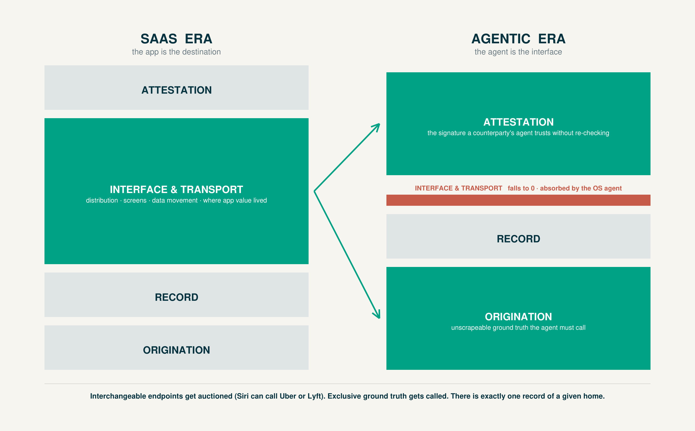

# The stack inverts. The home is the unclaimed end.

At WWDC 2026, Apple demoted apps from destinations to capabilities an OS-level agent invokes. Computing is moving from clicks ("open the plumber app") to goals ("fix my leak"). Transport between agents is two APIs and a schema; it trends to zero, and Apple just industrialized it. What survives splits in two: interchangeable supply gets auctioned by the OS — Siri can route a fare to Uber or Lyft indifferently, so margin moves to the aggregator — while exclusive ground truth gets called on its own terms. Value drains from the middle of the stack and pools at the ends.

**The home is the exclusive end.** Give any horizontal agent the same sentence — "my water heater is leaking" — and Siri, ChatGPT, and Gemini fail identically: each can find a plumber; none can know the unit is a 2019 Rheem, that the last valve repair ran $300, or that knob-and-tube wiring sits behind the wet drywall. The home is the largest undigitized environment on earth and it has no API; a better model cannot see through a wall. Unlike rides, the record cannot be crawled or multi-homed — there is exactly one consented record of a given house. Jackknife is building it: homeowner-originated, property-attributed, outcome-labeled.

**A first buyer compelled by law.** Post-NAIC, states now bar aerial imagery as the sole basis for adverse underwriting action and require current corroboration when a homeowner disputes it. The most predictive signals — water-heater age (non-weather water: ~24% of homeowner claims, ~$12.5K average severity), recalled electrical panels — are interior, precisely where aerial is blind. A consented, time-stamped record is the compliant second source. We facilitate evidence that may support better rates; we never determine coverage or guarantee savings.

**The moat is alignment — and we name the hazard first.** Marketplaces resell your inquiry; hardware locks you in; insurtech prices your data against you. Only an entity with no OS, no ads, no hardware, and no risk book can promise the record never leaves without the homeowner's permission — none of the Big Four can copy that without contradicting their own model. And the trust-platform hazard — the rated party pays — applies to us too: contractors buy introductions, never a position in the record. The record stays homeowner-owned either way.

**Where we are.** ~100 homes in Essex County, MA. Corroboration scaffolding — timestamps, geotags, licensed-contractor sign-off — ships first, because it is the product. A Massachusetts carrier backtest is the near-term proof. Density before breadth: standards ratify incumbents, and attestation is the North Star, not a badge we claim today.

*The internet built its counterparty-trust institution over two decades. The agentic economy requires the same institution for the asset itself. Both ends of the home stack are unclaimed.*
